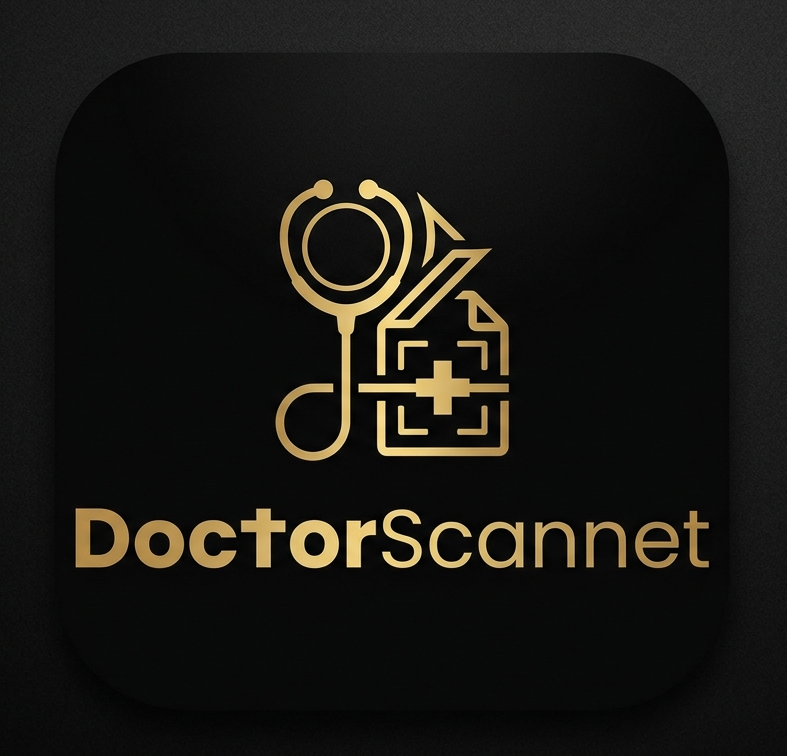

# DoctorScanner

<p align="center">
  
</p>

<h1 align="center">⚜️ Doctor Scanner Pro ⚜️</h1>

<p align="center">
  
  
</p>

<p align="right" dir="rtl">
<b>دکتر اسکنر (Doctor Scanner Pro)</b> یک ابزار فوق پیشرفته، پرسرعت و سبک برای تست پایداری و استخراج آی‌پی‌های سالم و تمیز کلادفلر (Cloudflare) در لایه ۴ شبکه (TCP Handshake) است. این پروژه با معماری نان-بلاکنیگ و چندرشته‌ای (Multi-threaded) طراحی شده و به دلیل <b>عدم نیاز به نصب هیچ‌گونه ماژول جانبی (No-Pip)</b>، بهینه‌ترین گزینه برای اجرا روی ترموکس اندروید، سرورهای لینوکس و ویندوز است.
</p>

---

<h2 align="right" dir="rtl">⚡ ویژگی‌های کلیدی ابزار</h2>

* **تم اختصاصی نئون-طلایی :** رابط کاربری تاریک بسیار مدرن با اسکرول‌بار و المان‌های نئونی اختصاصی.
* **سیستم پایش موازی (High-Concurrency):** قابلیت تنظیم رشته‌های موازی (Workers) تا ۳۰۰ رید همزمان برای سرعت بی‌سابقه.
* **تب‌بندی هوشمند دوحالته:**
    * **اسکن خودکار (Auto Scan):** دارای دو متد *سطحی/سریع* (بازه عمومی تمیز) و *عمیق/جامع* (کل رنج‌های ساختار دیتاسنتر کلادفلر) بدون نیاز به ورودی از طرف کاربر.
    * **اسکن دستی (Manual Scan):** امکان تایپ مستقیم، کپی رنج‌های CIDR و تک آی‌پی، یا ایمپورت آنی فایل متنی (`.txt`).
* **کنترلرهای پیشرفته (Custom Steppers):** مدیریت دقیق پورت‌ها، تایم‌اوت (میلی‌ثانیه) و سقف نمونه‌برداری با دکمه‌های کاملاً کاستوم.
* **سیستم نمونه‌برداری ایمن حافظه (Memory-Safe):** مهار محاسباتی برای جلوگیری از کرش یا لود سنگین رم در رنج‌های بزرگ (مانند `/13`) روی دیوایس‌های ضعیف.
* **مدیریت خروجی پیشرفته:** امکان کپی تکی آی‌پی، کپی دسته‌جمعی تمام کلین آی‌پی‌ها و دانلود مستقیم فایل خروجی به صورت ساختاریافته.

---

<h2 align="right" dir="rtl">🚀 راهنمای نصب و اجرا</h2>

<p align="right" dir="rtl">
برای اجرای این اسکنر نیازی به نصب هیچ پکیجی با دستور <code>pip</code> ندارید! سیستم کاملاً بر پایه کتابخانه‌های استاندارد پایتون پیاده‌سازی شده است.
</p>

```bash
# ۱. کلون کردن مخزن پروژه
git clone https://github.com/your_username/doctor-scanner.git

# ۲. ورود به پوشه پروژه
cd doctor-scanner

# ۳. اجرای هسته مرکزی اسکنر
python main.py

# هنگامی که main.py با موفقیت اجرا شد ادرس زیر را در مرورگر باز کنید تا بتوانید با سیستم تعامل کنید.
http://localhost:8080
